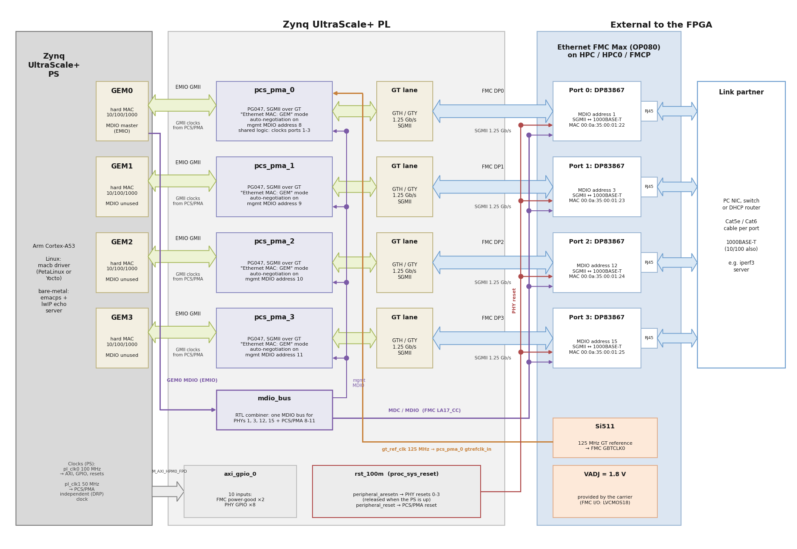
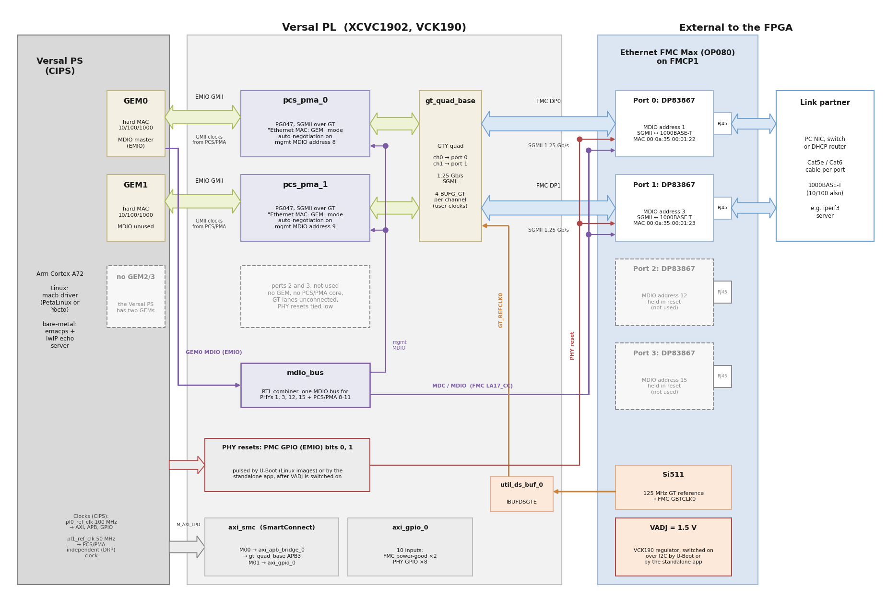

# Description

In this reference design, each port of the [Ethernet FMC Max] is driven by one of the hard
gigabit Ethernet MAC controllers (GEMs) of the processing system (PS) — the same MAC
controllers that normally drive the development board's onboard Ethernet ports. The GEMs
are routed into the programmable logic over EMIO GMII, where one Ethernet PCS/PMA or SGMII
core ([PG047]) per port converts the GMII to SGMII over a gigabit transceiver lane. The
SGMII lanes connect to the TI DP83867 PHYs on the Ethernet FMC Max.

The data path for each port is:

```
PS GEM <--EMIO GMII--> PCS/PMA core (PG047, SGMII) <--GT lane--> DP83867 PHY <--> RJ45
```

## Block diagrams

The diagrams below show the hardware design of each device family. The box titles are the
names of the cells in the Vivado block design (`Vivado/src/bd/bd_zynqmp.tcl` and
`Vivado/src/bd/bd_versal.tcl`), so you can find each block in the Vivado project.

### Zynq UltraScale+ (4 ports)



This diagram applies to the `uzev`, `zcu102_hpc0`, `zcu106_hpc0` and `zcu111` targets. All four
PS GEMs are routed to the programmable logic through EMIO, one per port of the Ethernet FMC Max.
The PCS/PMA core of port 0 contains the transceiver "shared logic" and supplies the transceiver
user clocks of the other three cores; it receives the 125 MHz GT reference clock from the Si511
oscillator on the mezzanine card. The PHY resets are released by the `proc_sys_reset` block
as soon as the PS is up, so no software is needed to bring the PHYs out of reset.

### Versal (2 ports)



This diagram applies to the `vck190_fmcp1` target. The Versal PS has two GEMs, so ports 0 and 1
are used. Both PCS/PMA cores connect to one GTY quad (`gt_quad_base`), and each core gets its
transceiver user clocks from its own BUFG_GT buffers. The FMC I/O of the VCK190 runs at
VADJ = 1.5 V, which is not on at power-up: the standalone application, or U-Boot in the Linux
images, switches VADJ on and then pulses the two PHY resets, which are driven by PMC GPIO (EMIO)
bits 0 and 1.

## Key points of the design

Key points of the architecture:

* **PS GEMs as the MACs:** No soft MAC or DMA IP is used in the programmable logic; the
  Ethernet traffic is handled by the hard GEM controllers of the PS, so the standard
  GEM software drivers (baremetal `emacps`, Linux `macb`) drive the ports.
* **PCS/PMA in "Ethernet MAC: GEM" mode:** Each PCS/PMA core is configured for the GEM
  and generates the GMII TX/RX clocks for it, adapting the data rate to the speed
  resolved by SGMII auto-negotiation with the PHY. The cores power up with the IEEE
  ISOLATE bit set, so software clears it over MDIO before traffic flows (the standalone
  application does this as it brings each port up; Linux uses the `pcs-unisolate` boot
  service).
* **Shared MDIO bus:** The Ethernet FMC Max has a single MDIO bus for its four PHYs
  (addresses 1, 3, 12 and 15 for ports 0-3). GEM0 masters that bus and manages all four
  PHYs, and also reaches every PL PCS/PMA core's management interface at address 8+port
  (8-11) to clear its ISOLATE bit. The MDIO masters of the other GEMs are unused.
* **Port mapping:** GEM*n* drives port *n* of the Ethernet FMC Max. The Zynq UltraScale+
  targets use all four GEMs (4 ports); the Versal PS has only two GEMs, so the Versal
  target (VCK190) drives ports 0 and 1, and the PHYs of ports 2 and 3 are held in reset.
* **Maximum link speed is 1 Gbps:** The PS GEM EMIO GMII path supports 10M/100M/1G
  operation. With a 1000BASE-T link partner, `iperf3` reaches about 940 Mbit/s in each
  direction on every port (see [Yocto](yocto.md#test-the-ports-with-iperf3)).
* **VADJ:** the FMC I/O (MDIO, PHY resets, PHY GPIOs, power-good signals) is LVCMOS18 on the
  Zynq UltraScale+ boards and LVCMOS15 on the VCK190. On the VCK190 the 1.5 V VADJ rail is
  switched on by software (the standalone application, or U-Boot in the Linux images).

```{note}
Because the GEMs are routed to the FMC through EMIO in these designs, the
development board's onboard Ethernet ports (normally wired to the GEMs through MIO)
are not available.
```

## Hardware Platforms

The hardware designs provided in this reference are based on Vivado and support a range of MPSoC and ACAP evaluation
boards. The repository contains all necessary scripts and code to build these designs for the supported platforms listed below:


    
    
        
            
        
    
    
### {{ group.name }} platforms

| Target board        | FMC Slot Used | Supported<br>Num. Ports   | Standalone<br> Echo Server | PetaLinux | Yocto |
|---------------------|---------------|---------|-----|-----|-----|
| [{{ design.board }}]({{ design.link }}) | {{ design.connector }} | {{ design.lanes | length }}x |  ✅  ❌  |  ✅  ❌  |  ✅  ❌  |




## Software

These reference designs can be driven by a standalone application or by embedded Linux, built
with either PetaLinux or Yocto (the AMD Embedded Development Framework, EDF). The repository
includes all necessary scripts and code to build all three. The table below outlines the
applications available in each environment:

| Environment      | Available Applications  |
|------------------|-------------------------|
| Standalone       | lwIP Echo Server |
| PetaLinux        | Built-in Linux commands<br>Additional tools: ethtool, phytool, iperf3 |
| Yocto (EDF)      | Built-in Linux commands<br>Additional tools: ethtool, phytool, iperf3, mtd-utils, can-utils, nfs-utils, pciutils |

Both Linux flows also install the `pcs-unisolate` boot service, which the ports need in order
to pass traffic (see [PCS/PMA ISOLATE bit](advanced.md#pcspma-isolate-bit-and-the-pcs-unisolate-service)).


[Ethernet FMC Max]: https://docs.opsero.com/op080/datasheet/overview/
[PG047]: https://docs.amd.com/r/en-US/pg047-gig-eth-pcs-pma
