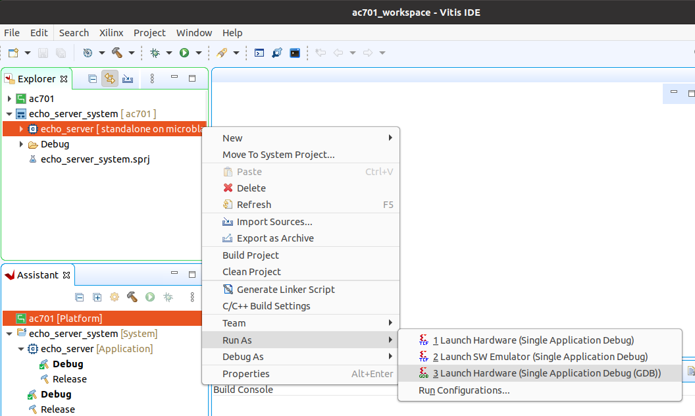

# Stand-alone lwIP Echo Server

These reference designs use the standalone lwIP echo-server application
template that ships with Vitis, layered with local modifications needed to
drive the Ethernet FMC Max ports from the PS GEMs through the PL PCS/PMA
(SGMII) cores. The `Vitis/` directory of the repository contains a universal
Vitis Python build driver (`py/build-vitis.py`, configured by `py/args.json`)
that creates the workspace, registers a local `embeddedsw` software repository
containing the patched lwIP sources, and builds the application.

The build script does the following:

1. Creates a Vitis workspace at `Vitis/<target>_workspace`.
2. Creates a subdirectory called `embeddedsw` inside the workspace to be used
   as a local software repository containing the modified lwIP library
   (sourced from the repo's `EmbeddedSw/` directory).
3. Copies the modified sources from `EmbeddedSw/` over the corresponding
   stock files copied in from the Vitis installation, so the local repository
   has both the modifications and the unchanged supporting files.
4. Generates a lwIP Echo Server application linked against that local
   `embeddedsw` repository for the selected target. A pre-build hook
   (`py/pre_build.py`) patches `platform_config.h.in` in the application
   sources to add the Ethernet port selection described
   [below](#change-the-target-port).

The lwIP modifications (in `EmbeddedSw/`, applied to
`xemacpsif_physpeed.c`) account for the specifics of these designs: the
four DP83867 PHYs share one MDIO bus mastered by GEM0, so GEM0's PHY
detection is restricted to the port 0 PHY at address 1; and the TI PHYs are
always managed through their SGMII speed path, since the GEMs connect to
them through EMIO GMII and a PCS/PMA core.

## Building the Vitis workspace

To build the Vitis workspace and example application, you must first generate
the Vivado project hardware design (the bitstream) and export the hardware.
Once the bitstream is generated and exported, then you can build the
Vitis workspace using the provided scripts. Follow the
[build instructions](/build_instructions.md#build-vitis-workspace) — the
steps are the same on Windows and Linux.

## Run the application

You must have followed the build instructions before you can run the application.

1. Launch the Xilinx Vitis GUI.
2. When asked to select the workspace path, select the `Vitis/<target>_workspace` directory.
3. Power up your hardware platform and ensure that the JTAG is connected properly.
4. In the Vitis Explorer panel, double-click on the System project that you want to run -
   this will reveal the application contained in the project. The System project will have 
   the postfix "_system".
5. Now right click on the application "echo_server" then navigate the
   drop down menu to **Run As->Launch on Hardware (Single Application Debug (GDB)).**



The run configuration will first program the FPGA with the bitstream, then load and run the 
application. You can view the UART output of the application in a console window and it should
appear similar to the following (a Zynq UltraScale+ target with the selected port connected
to a router with DHCP - the assigned board IP will vary):

```
Zynq MP First Stage Boot Loader 
Release 2025.2
PMU-FW is not running, certain applications may not be supported.


-----lwIP TCP echo server ------
TCP packets sent to port 6001 will be echoed back
Start TI PHY autonegotiation in SGMII Mode 
Waiting for PHY to complete autonegotiation.
autonegotiation complete 
link speed for phy address 1: 1000
Board IP: 192.168.2.72
Netmask : 255.255.255.0
Gateway : 192.168.2.1
TCP echo server started @ port 7
```

On the VCK190 you'll also see a PLM banner and a `VADJ: 1.5V enabled successfully`
line ahead of the echo-server header — `vadj_enable(VADJ_1V5)` runs at the top of `main()`
to bring the FMC adjustable rail up to 1.5V via the on-board power controller before the
PHYs are released from reset (see `Vitis/common/src/vadj.c`).

## UART settings

To receive the UART output of this standalone application, you will need to connect the
USB-UART of the development board to your PC and run a console program such as 
[Putty]. All targets in this repo use 115200 baud, 8N1.

## IP address

By default, the echo server attempts to obtain an IP address from a DHCP server. This is useful
if the echo server is connected to a network. Once the IP address is obtained, it is printed out
in the UART console output.

If instead the echo server is connected directly to a PC, the DHCP attempt will fail and the echo
server's IP address will default to 192.168.1.10. To be able to communicate with the echo server
from the PC, the PC should be configured with a fixed IP address on the same subnet, for example:
192.168.1.20.

## Change the target port

The echo server example design currently can only target one Ethernet port at a time.
Selection of the Ethernet port can be changed by modifying the ``ETHERNET_PORT`` define
in the ``platform_config.h.in`` file located in the workspace application sources
(eg. ``<target>_workspace/echo_server/src/platform_config.h.in``). Each port is driven
by the PS GEM of the same index, so the selection picks the corresponding GEM.
Set ``ETHERNET_PORT`` to one of the following values:

* ``0``: Ethernet FMC Port 0 (GEM0)
* ``1``: Ethernet FMC Port 1 (GEM1)
* ``2``: Ethernet FMC Port 2 (GEM2)
* ``3``: Ethernet FMC Port 3 (GEM3)

```{important}
The VCK190 design supports ports 0 and 1 only - the Versal PS has two
GEM controllers and the PHYs of ports 2 and 3 are held in reset in that design.
```

## Example usage

### Ping the port

The echo server can be "pinged" from a connected PC, or if connected to a network, from
another device on the network. The UART console output will tell you what the IP address of the 
echo server is. To ping the echo server, use the `ping` command from a command console of a PC
that is connected to the echo server (either directly or via network).

Example command: `ping 192.168.1.10`

### Connect with telnet

We can also connect to the echo server using telnet and confirm that it is sending back (echoing) the data
that we are sending it. From the command prompt of a PC on the same network as the echo server, run the
following command:

Example command: `telnet 192.168.1.10 7`

The first argument of the telnet command specifies the IP address of the device to connect to (in our case
the echo server). The last argument in the command specifies the port number, which should be 7 for the 
echo server.

In the blank screen that opens after running the command, you can type letters and they will be sent to the 
echo server and be echoed back.


[Putty]: https://www.putty.org
